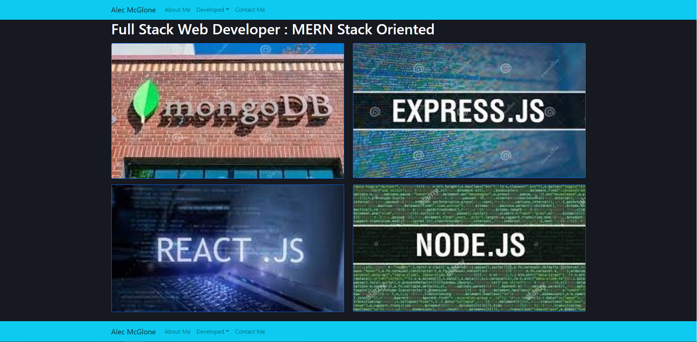
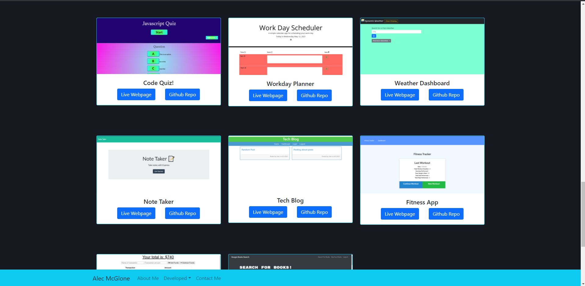

# Alec McGlone Portfolio 

  ## Description
* A portfolio made to display accomplishments and recent web development projects
* Finished applications can be found on the developed page
* React Portfolio

  
  
  ## Table of Contents
  * [Technologies](#technologies)
  * [Usage](#usage)
  * [Contributing](#contributing)
  * [License](#license)
  
  ## Technologies

* This project is built using the following:
    * HTML
    * CSS
    * Javascript
    * React.js
    * react-bootsrap
    * react-router-dom
    * Heroku for deployment

  ## Usage

  Navigate to the live webpage! https://alecmcglone.herokuapp.com/

  ## Home Page
  
  ## About Page
  
  ## Developed Page
  

  ## Contributing

  For contributions please open an issue or new pull request

  ## Test

  n/a
  
  ## Questions

  I can answer questions via email or through github

  * Github Profile: [Alec74](https://github.com/Alec74)
  * alecmcglone@gmail.com
  * LinkedIn Profile: [AlecM](https://www.linkedin.com/in/alec-mcglone-900904206/)
  
  ## License
  Notice: This application is licensed under MIT
  
  [License-Link](./LICENSE)